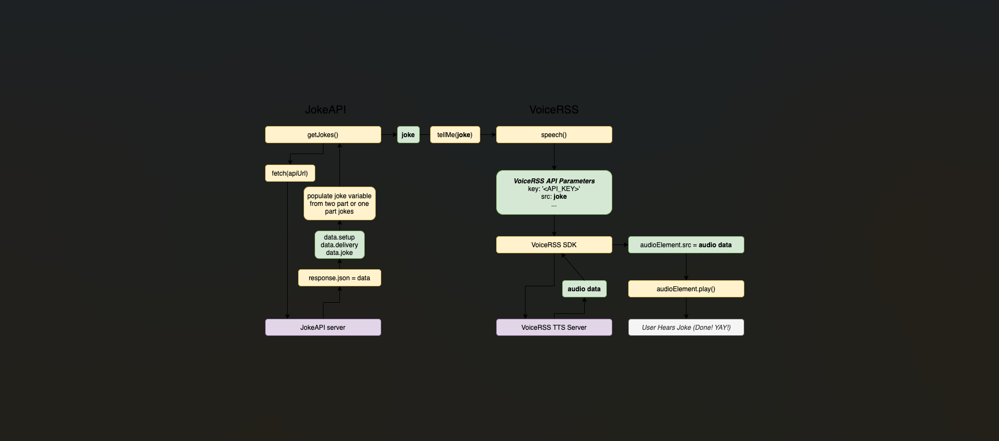

# Joke Teller

A simple JavaScript project that tells random jokes to users use api .

## Features

- Fetches random jokes from an API
- Displays jokes in a user-friendly interface
- Responsive and easy to use

## Getting Started

3. **Open `index.html` in your browser.**

## Usage

- Click the "Tell me a joke" button to get a new joke.

## Technologies Used

- HTML
- CSS
- JavaScript
- Joke API (e.g., [Official Joke API](https://official-joke-api.appspot.com/))

